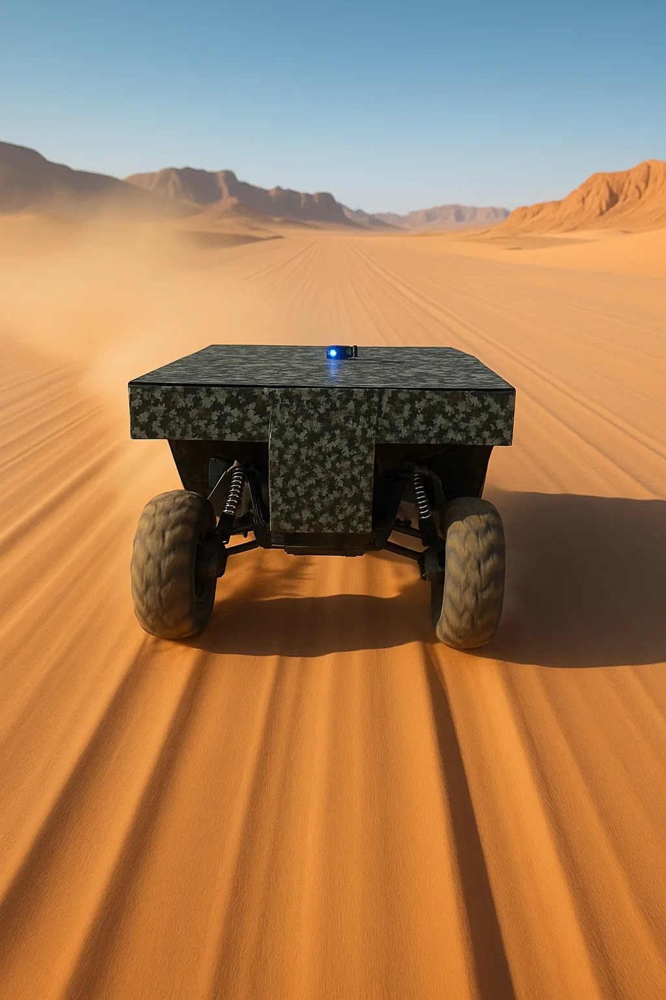
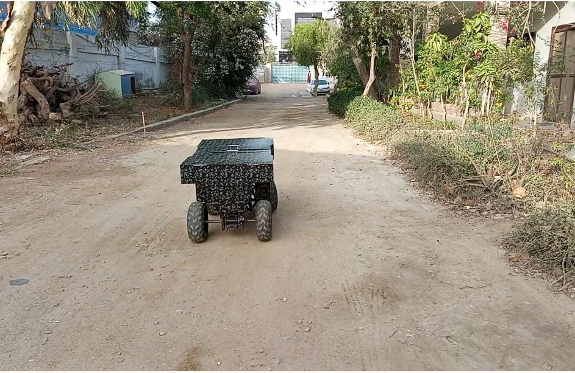

# Autonomous-ATV
Undergraduate Final Year project

## Abstract
This thesis presents the design and development of an autonomous Unmanned Ground Vehicle (UGV) based on a full-scale 110 cc All-Terrain Vehicle (ATV) platform. Leveraging a simulation-first methodology using Gazebo, PX4, and ROS 2, the project validates a Pure Pursuit path-tracking controller in MATLAB, accounting for throttle nonlinearity and realistic vehicle dynamics. The hardware architecture integrates Pixhawk 5X, Arduino Nano, servos, and an Electric Power Steering (EPS) module, with real-time GPS navigation via the Here 3 module and QGroundControl. Field trials on sandy terrain confirm robust waypoint-following and off-road capability.
## 📸 Project Media

### Field Test Photos

<!-- assumes your pics are in videos/pic1.jpg and videos/pic2.jpg -->

*Fig.1*

*Fig.2*

### 🎥 Demo & Test Videos

<!-- HTML5 video embeds work on GitHub -->
<video width="640" controls>
  <source src="videos/Auto Testing.mp4" type="video/mp4">
  Your browser doesn’t support embedded video.
</video>

<em>Video 1 – Offboard control test on rough terrain.</em>

<video width="640" controls>
  <source src="videos/Video1.mp4" type="video/mp4">
  Your browser doesn’t support embedded video.
</video>

<em>Video 2 – SITL-Gazebo pure pursuit demonstration.</em>

## Features
Gazebo Simulation Environment: Full off-road simulation with customizable waypoints and sensor models, powered by PX4 SITL and ROS 2.

Pure Pursuit Controller in MATLAB: Algorithm implementation with lookahead-distance tuning and throttle-response modeling.

Mechanical & Electrical Integration: Automated steering, throttle, and braking using servos, mechanical linkages, and an EPS module.

Real-Time GPS Navigation: Here 3 GNSS module integration for waypoint-based point-to-point navigation via QGroundControl.

Field-Tested Prototype: Demonstrated off-road driving performance in real terrain, highlighting system robustness.
